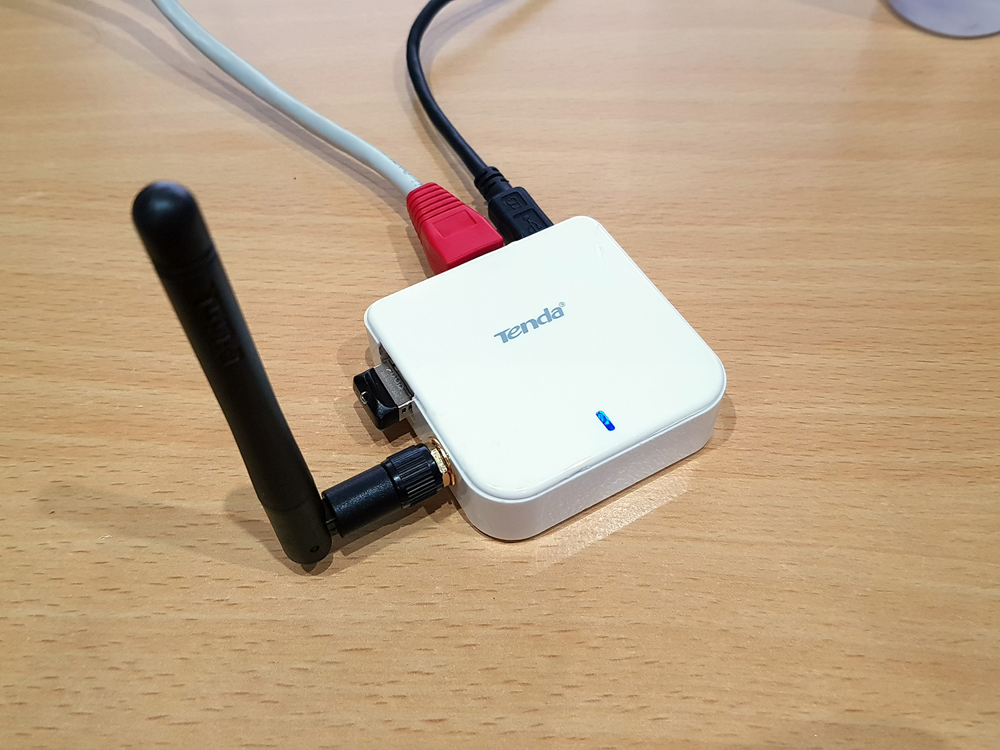
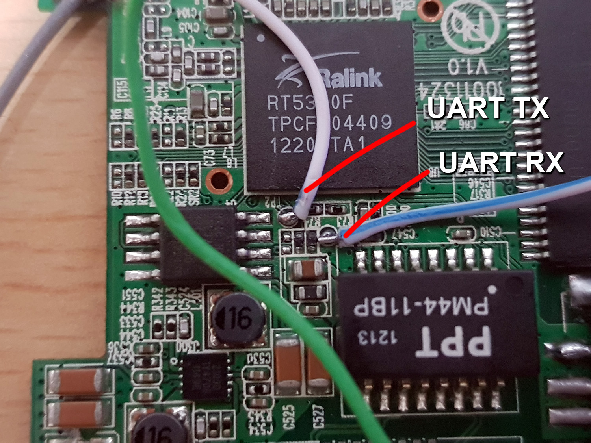
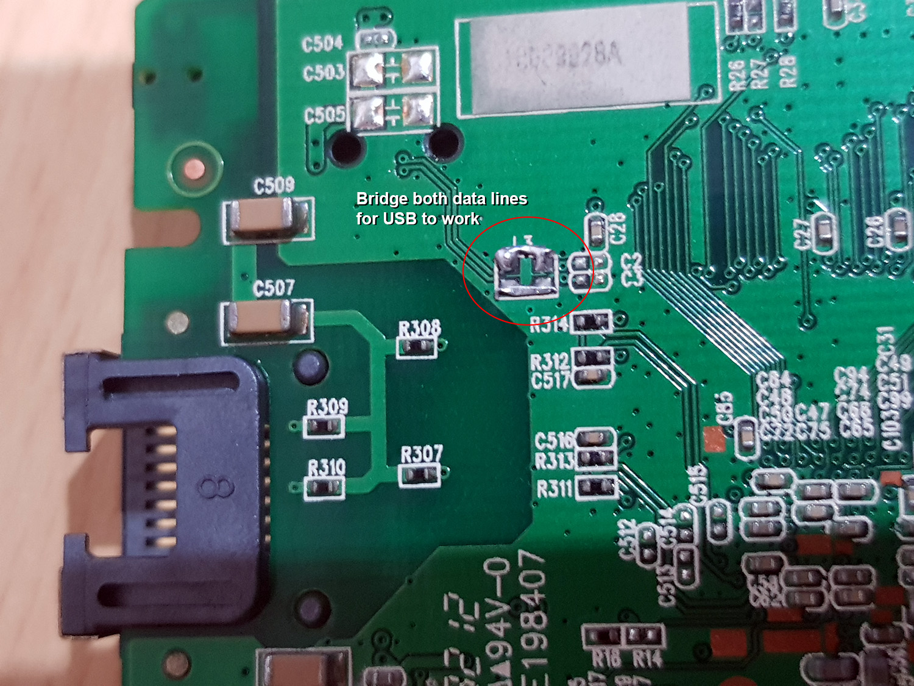
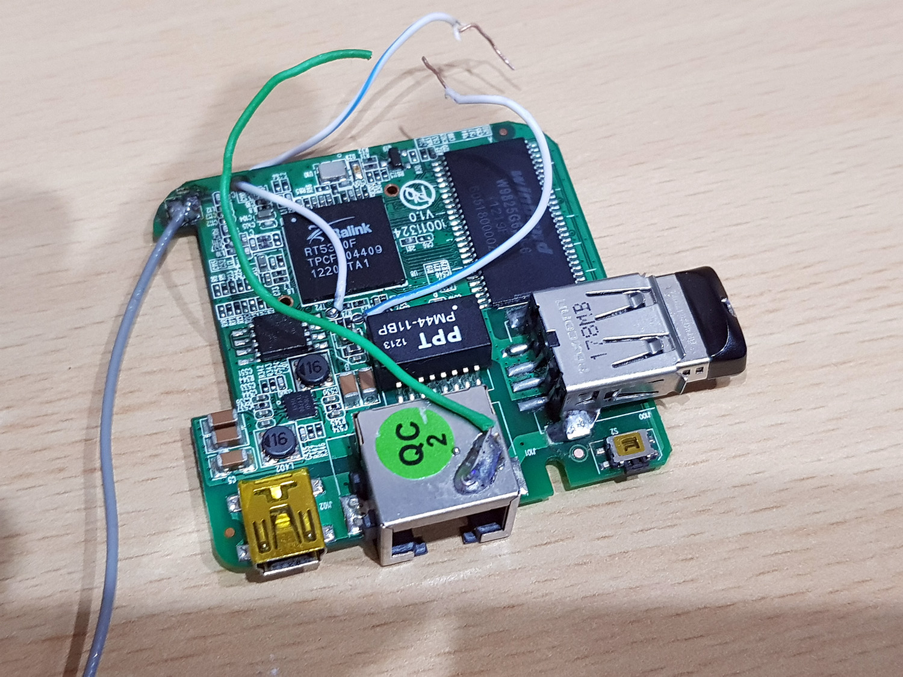

# OpenWrt-A6

***Preface:** I have published a pull request for OpenWrt to officially support the Tenda A6 - see https://github.com/openwrt/openwrt/pull/2988. In the meanwhile, you can use this :)*

<a href="photos/tenda-a6_mod-complete.jpg"></a>
<a href="photos/tenda-a6_uart-pins.jpg"></a>
<a href="photos/tenda-a6_usb-enable.jpg"></a>
<a href="photos/tenda-a6_usb-populated.jpg" title="USB port added successfully!"></a>

This repo details the process to get OpenWrt up and running on a Tenda A6, a miniature but potentially feature-rich wireless router for the price. It is very similar to the unbranded A5-V11 (https://oldwiki.archive.openwrt.org/toh/unbranded/a5-v11), sharing the same SoC - Ralink/MediaTek RT5350F. It has 32MiB of RAM memory, and 4MiB of SPI flash storage.

There is already some information on the OpenWrt Wiki about this device (https://openwrt.org/toh/tenda/a6), although that has become stale and the patches and build instructions aren't relevant for current builds of OpenWrt (v19.07 / May 2020) anymore.

The included 4MiB of flash is very restrictive - it is neither possible to include OpenWrt's LuCi in the flash image, nor to install it via opkg, unless you add some additional storage to the device. If you don't need the LuCi web interface, that could be fine for you. Otherwise, we have two options to expand storage - either by replacing the 4MiB flash chip on board with a larger flash chip, or adding external USB storage. Both methods will require some soldering - if you can't solder then I would really suggest just keeping the factory firmware instead.

Fortunately, the RT5350F SoC chip comes with USB support, and the A6 even has a 'hidden' (unpopulated) USB port header (see above images for details). It is not enough to just solder on a USB port or cable to the exposed headers - you must also bridge the D+ and D- filter paths at the back of the unit.

Access to the PCB can be optained by delidding the top of the enclosure, which involves *carefully* scoring around the edge with a sharp knife until it pops open. Mine popped open quite easily, but YMMV.

*You can optionally connect a UART USB/serial device (see https://iotnewsgenerator.wordpress.com/2016/03/27/tenda-a6-wifi-router/) in order to monitor device status which can be helpful for streamlining or debugging the TFTP process described below. Set baud rate for UART interface to 57600.*

If you wish to compile from source, you can use patch file `openwrt-19.07.2-tenda-a6.patch` (see building instructions further below), or you can just use the provided images for flashing, following appropriate steps below for either approach.

### How-to: flash
#### Method 1 - Upgrade by factory firmware's Web UI
It is possible to upgrade from the factory-loaded firmware using the Web UI, but you must *not* upgrade directly to squashfs-sysupgrade image from factory firmware. Rather, you will need to use the initramfs image, or you will brick your device! *You have been warned.*

**Step 1:** Download temporary initramfs bin <a href="https://raw.githubusercontent.com/fragtion/openwrt-hardware/master/tenda-a6/images/openwrt-ramips-rt305x-a6-initramfs-kernel.bin">openwrt-ramips-rt305x-a6-initramfs-kernel.bin</a>

**Step 2:** Flash downloaded bin from the factory firmware's web UI's firmware upgrade interface. The router will reboot as indicated by the web UI. Allow sufficient time for the reboot and upgrade to complete. OpenWrt takes longer to boot than the factory-supplied firmware, so be patient.

**Step 3:** During this time, you can set your computer's IP address to 192.168.1.2. After about 5 minutes, you should be able to ping the router at 192.168.1.1.

**Step 4:** SSH to the router at 192.168.1.1. Username is root, and there is no password. Do not change password yet, as you are still on a temporary ROM.

**Step 5:** Edit device's network configuration for internet access `vi /etc/config/network`. Assuming your internet router is at 192.168.0.1:

```
config interface 'lan'
        option type 'bridge'
        option ifname 'eth0'
        option proto 'static'
        option ipaddr '192.168.0.2'
        option netmask '255.255.255.0'
        option gateway '192.168.0.1'
        option dns '192.168.0.1'
```

**Step 6:** Download the full image <a href="https://raw.githubusercontent.com/fragtion/openwrt-hardware/master/tenda-a6/images/openwrt-ramips-rt305x-a6-squashfs-sysupgrade.bin">openwrt-ramips-rt305x-a6-squashfs-sysupgrade.bin</a> to `/tmp` folder on the device, and proceed with inplace upgrade as follows:

```
cd /tmp
wget https://raw.githubusercontent.com/fragtion/openwrt-hardware/master/tenda-a6/images/openwrt-ramips-rt305x-a6-squashfs-sysupgrade.bin
sysupgrade -F -n openwrt-ramips-rt305x-a6-squashfs-sysupgrade.bin
```

The device will self-reboot, and will take about 5 minutes before you can ping 192.168.1.1 again. Be patient...

You can then log in via SSH as root, with no password. At this point you should change the root password.

**Step 7:** Done! You're now ready to go to Post-flashing

### Method 2 - Upgrade via SPI Programmer (Full image flash)
**Step 1:** Ensure that the device is not powered by USB

**Step 2:** Write <a href="https://github.com/fragtion/openwrt-hardware/blob/master/tenda-a6/flashdumps/flashdump-openwrt-ramips-rt305x-a6-squashfs.bin?raw=true">flashdump-openwrt-ramips-rt305x-a6-squashfs.bin</a> to flash chip using using SPI programmer of choice

**Step 3:** Verify flashed image if programmer supports it

**Step 4:** Done! Boot it up and you're ready to go to Post-flashing.

### Method 3 - Upgrade by SPI Programmer (TFTP image from new uboot)
**Step 1:** Ensure that the device is not powered by USB

**Step 2:** Flash OpenWrt-compatible uboot <a href="https://raw.githubusercontent.com/fragtion/openwrt-hardware/master/tenda-a6/bootloader/uboot256.bin">uboot256.bin</a> using using SPI programmer of choice

**Step 3:** Verify flashed image if programmer supports it

**Step 4:** Power on the device while holding reset button, and proceed to TFTP the squashfs-sysupgrade image (see Troubleshooting section below for TFTP instructions)

**Step 5:** Done! Boot it up and you're ready to go to Post-flashing

### Post-flashing (USB extroot & LuCi setup)
Once you've got OpenWrt successfully booted up to the squashfs-sysupgrade image (and assuming you were able to solder on a USB port correctly), you should now make use of external USB storage to extend the limited onboard rootfs storage.

You can follow the official quickstart guide at https://openwrt.org/docs/guide-user/storage/usb-drives-quickstart, or alternatively use my method below:

First, using a partitioning tool of your choice (eg, minitool partition wizard for windows, or gparted for linux), prepare the USB storage into 3 partitions as follows:

```
Partition 1: primary, ext4, boot/active (for extending /overlay/)
Partition 2: primary, swap (for swap obviously)
Partition 3: primary, ext4 (for custom /data/ mountpoint)
```

*Size ratios are up to you. I used a 8GB flash drive, with 3GB for /overlay, 1GB for swap, and 4GB for /data)*

Plug in the USB drive and ensure that it is detected by your A6 (`dmesg`, or `ls /dev/sda` will work)...

Assuming your USB device was found, now execute the following:

```
mkdir -p /underlay
mkdir -p /data
mount /dev/sda1 /mnt
tar -C /overlay/ -cvf - . | tar -C /mnt/ -xf -
rm -f /mnt/etc/.extroot-uuid
```

Now edit fstab `vi /etc/config/fstab` *(note: this file is not the same as `/etc/fstab`, which shouldn't be touched)*, as follows:

```
config global
        option anon_swap '0'
        option anon_mount '1'
        option auto_swap '1'
        option auto_mount '1'
        option delay_root '5'
        option check_fs '0'

config mount
        option target '/underlay'
        option device '/dev/mtdblock6'
        option enabled '1'

config mount
        option target '/overlay'
        option device '/dev/sda1'
        option enabled '1'

config swap
        option device '/dev/sda2'
        option enabled '1'

config mount
        option target '/data'
        option device '/dev/sda3'
        option enabled '1'
```

Commit and apply the changes to `/etc/config/fstab` by executing `uci commit && service fstab enable`

Now `reboot` the router. When you log in again you should see that the space has grown when you use the `df` command and /overlay is mounted as `/dev/sda1` when you use the `mount` command.

You can now proceed to install LuCi to your (much bigger!) extroot space...:

```
echo src/gz openwrt_core http://downloads.openwrt.org/releases/18.06.5/targets/ramips/rt305x/packages > /etc/opkg/distfeeds.conf
echo src/gz openwrt_kmods http://downloads.openwrt.org/releases/19.07.2/targets/ramips/rt305x/kmods/4.14.171-1-9a90d552f1e8ed4f201155596f60004e >> /etc/opkg/distfeeds.conf
echo src/gz openwrt_base http://downloads.openwrt.org/releases/19.07.2/packages/mipsel_24kc/base >> /etc/opkg/distfeeds.conf
echo src/gz openwrt_luci http://downloads.openwrt.org/releases/19.07.2/packages/mipsel_24kc/luci >> /etc/opkg/distfeeds.conf
echo src/gz openwrt_packages http://downloads.openwrt.org/releases/19.07.2/packages/mipsel_24kc/packages >> /etc/opkg/distfeeds.conf
echo src/gz openwrt_routing http://downloads.openwrt.org/releases/19.07.2/packages/mipsel_24kc/routing >> /etc/opkg/distfeeds.conf
echo src/gz openwrt_telephony http://downloads.openwrt.org/releases/19.07.2/packages/mipsel_24kc/telephony >> /etc/opkg/distfeeds.conf
opkg update
opkg install luci
```

You now should have a fully functional OpenWrt with a Web UI (LuCi) and a lot of space to install whatever you want and use your device as normal. Enjoy!!

### How-to: build from source

```
wget https://github.com/openwrt/openwrt/archive/v19.07.2.tar.gz
tar -zxf v19.07.2.tar.gz
cd openwrt-19.07.2
wget https://raw.githubusercontent.com/fragtion/openwrt-hardware/master/tenda-a6/openwrt-19.07.2-tenda-a6.patch
patch -p1 < openwrt-19.07.2-tenda-a6.patch
make defconfig && make
```
*To speed up the build process, you can try running `make defconfig && make -j9` instead (where 9 in -j9 represents CPU thread count+1)*

If you wish to customize kernel modules/packages (I do not recommend this, due to the small flash size), just replace `make defconfig` with `make menuconfig`, or edit `.config` by hand according to your needs

### Important notes
If you need to use the UART serial interface, bear in mind that it will only allow input/choice selection one time only, after which the SoC then blocks all future input. If something goes wrong after that and you can't boot, there should be no need to panic (or worse, throw away some perfectly good hardware!), as the device can be de-bricked with the right tools. You will just need to re-flash the bootloader and then TFTP. See Troubleshooting section below.

Also, as this is a custom-built kernel, the kernel hash will differ from official builds, so you may encounter a dependency error when installing custom kernel modules with opkg, eg:
```Collected errors:
 * satisfy_dependencies_for: Cannot satisfy the following dependencies for kmod-tun:
 *      kernel (= 4.14.171-1-9a90d552f1e8ed4f201155596f60004e)
```
This is an OpenWrt safe-guard by design, to alleviate against obscure bug reports. Your best approach here is to build required kernel modules from source. Or you could try work around by passing `opkg` argument `--force-checksum`, but this could likely cause your device to lockup when that module loads. In that case you should remove the USB drive, mount it separately and delete the offending module file from `/upper/lib/modules/4.14.171/` (on the USB drive of course), and then resort back to building the module from source instead.

### Troubleshooting
If you think you bricked the device, you can probably still recover using a CH341A or similar SPI programmer (Raspberry PI can work too). Supplied bootloader image file <a href="https://raw.githubusercontent.com/fragtion/openwrt-hardware/master/tenda-a6/bootloader/uboot256.bin">uboot256.bin</a> was found at repository https://github.com/ozayturay/OpenWrt-A5-V11/

After flashing the uboot with SPI programmer, power-cycle the device while holding down the reset button, and upload new image via TFTP:

`tftp -i 192.168.1.1 PUT openwrt-ramips-rt305x-a6-squashfs-sysupgrade.bin`

*Please note that the device will not respond to pings during the uboot/tftp process. But if you do everything right, you should see a TFTP success message, and then wait about 5-10 minutes for flashing, after which you can ping and SSH to 192.168.1.1*

No need to reboot after tftp as it will do so automatically. Give it time (5-10 minutes) to boot to OpenWrt and initialize ethernet (patience is key)

### Restoring Tenda A6's factory firmware (A6_V3.00.20_EN.bin)
If you decide that OpenWrt is not for you, here's how you can get your router back to its factory-fresh state

**Step 1:** Download <a href="https://github.com/fragtion/openwrt-hardware/blob/master/tenda-a6/flashdumps/flashdump-A6_V3.00.20_EN.bin?raw=true">flashdump-A6_V3.00.20_EN.bin</a>, and set MAC address according to sticker under your device

For example, if you want to set MAC to `C8:3A:35:00:00:A6`:

`printf '\xC8\x3A\x35\x00\x00\xA6' | dd of=flashdump-A6_V3.00.20_EN.bin bs=1 seek=262148 count=6 conv=notrunc`

**Step 2:** Ensure that the device is not powered by USB

**Step 3:** Write `flashdump-A6_V3.00.20_EN.bin` to flash chip using using SPI programmer of choice

**Step 4:** Verify flashed image if programmer supports it

**Step 5:** Done!

### Disclaimer
Anything you do to your own router is your own responsibility. I am not responsibile for your actions and/or any damages or losses that may result, such as a bricked router. These methods worked for me, I offer no guarantees that the same will be true for you. Proceed at your own risk. If you do, then Good luck! :)

### Donate
Did this make you happy? I'd love to do more development like this! Please donate to show your support :)

BTC: 1Q4QkBn2Rx4hxFBgHEwRJXYHJjtfusnYfy

XMR: 4AfeGxGR4JqDxwVGWPTZHtX5QnQ3dTzwzMWLBFvysa6FTpTbz8Juqs25XuysVfowQoSYGdMESqnvrEQ969nR9Q7mEgpA5Zm
